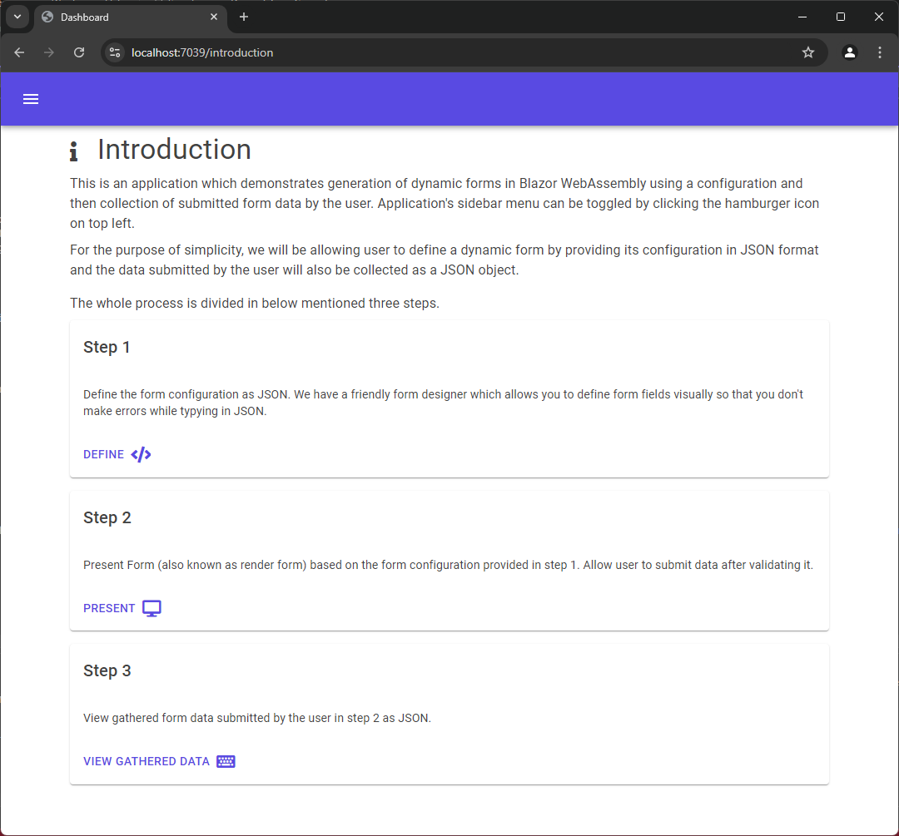
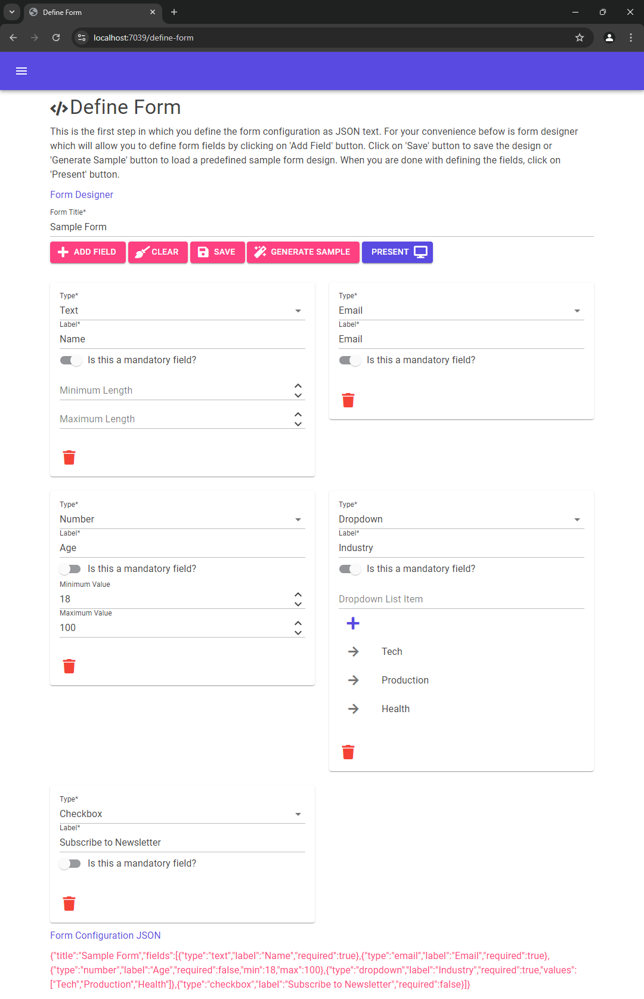
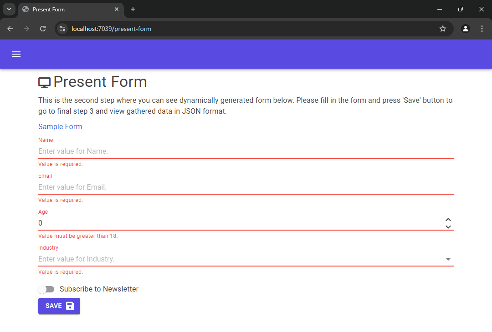
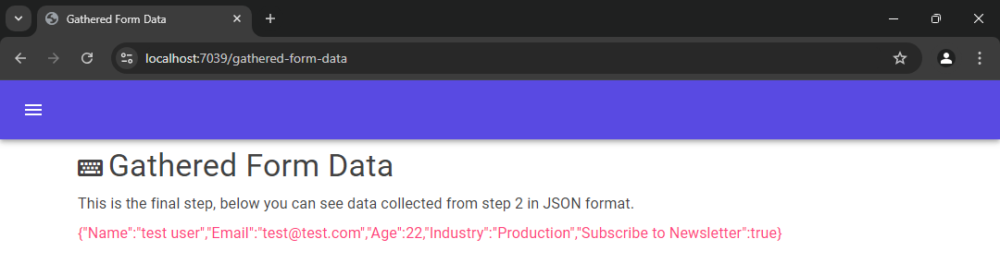
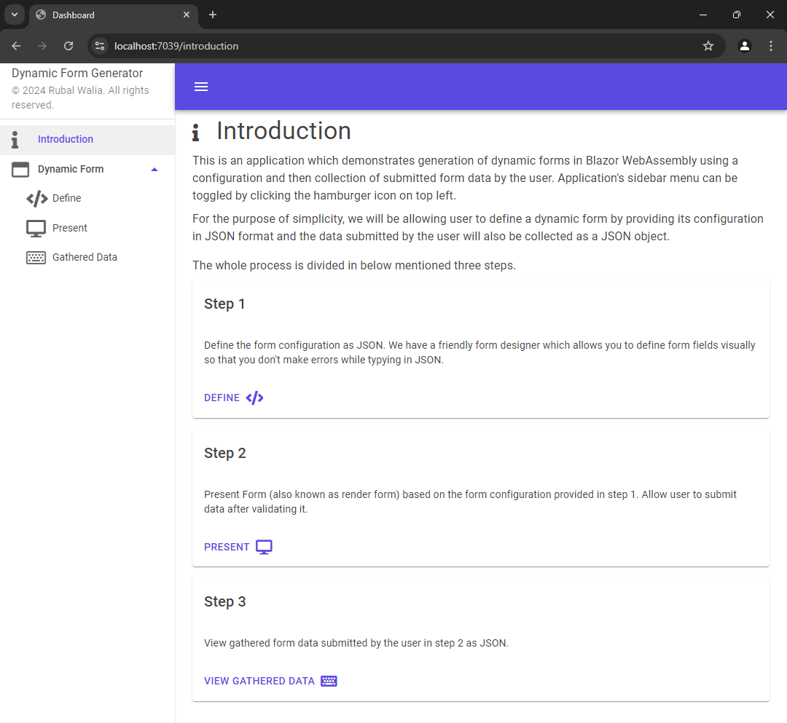

# Dynamic Form Generator

## Introduction
This is a demonstration application which shows generation of dynamic forms using Blazor WebAssembly. The forms are generated based on JSON form configurations and presented to user. The data submitted by user on dynamic form is also kept as JSON. Project also has a form designer which allows user to define form fields visually instead of having to write JSON manually by hand. UI has a sidebar which can be used to navigate to various pages. An introduction landing page is also developed. All the data is stored in-memory in JSON string format which is shared across application pages via a singelton service injected via DI.

This is the introduction page which tells about the application.

This forms allows user to define form and its dynamic fields. Generated JSON configuration is shown in the btoom after user presses save button. Generate sample button will replace current form with a sample usecase design.

This form shows the dynamically rendered form. Below screenshot shows validation errors when user pressed save button.

This shows JSON data collected via dynamic form when user saved it.

The application sidebar.

## Technologies & Tools Used
* Visual Studio 2022 (Community)
* Microsoft .NET Framework 8
* Blazor WebAssembly
* MudBlazor (for UI)
* C# (programming language)
* Font Awesome 5 (for icons)

## Assumptions
* Numeric fields are always integer as other number types are not dealt with.
* In dropdown field type, only string data is used.

## Project Execution
Clone the project and open 'src' directory from which open the solution 'DynamicFormGenerator.sln' in Visual Studio 2022 and hit the run button (hilighted below). Browser will automatically open when the project is running.

